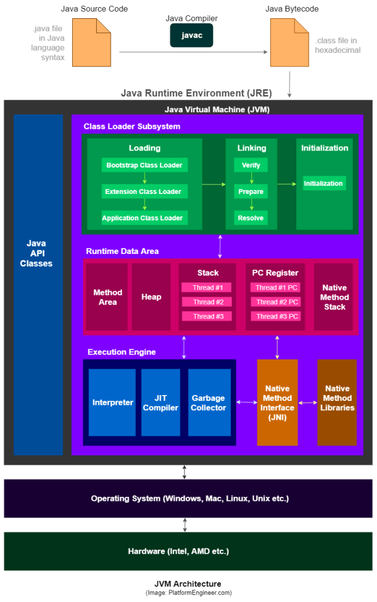

# Java virtual machine document

## What is the jvm

A Java virtual machine (JVM) is a virtual machine that enables a computer to run Java programs as well as programs written in other languages that are also compiled to Java bytecode.

## Why we need jvm

The Java Virtual Machine is the cornerstone of the Java platform. It is the component of the technology responsible for its hardware- and operating system-independence, the small size of its compiled code, and its ability to protect users from malicious programs.

## The jvm architecture



- Run-Time Data Areas
  : The Java Virtual Machine defines various run-time data areas that are used during execution of a program. Some of these data areas are created on Java Virtual Machine start-up and are destroyed only when the Java Virtual Machine exits. Other data areas are per thread. Per-thread data areas are created when a thread is created and destroyed when the thread exits.
  *pc register*
  : Each Java Virtual Machine thread has its own pc (program counter) register.
  *jvm stacks*
  : Each Java Virtual Machine thread has a private Java Virtual Machine stack, created at the same time as the thread.
  - If the computation in a thread requires a larger Java Virtual Machine stack than is permitted, the Java Virtual Machine throws a *StackOverflowError*.
  - If Java Virtual Machine stacks can be dynamically expanded, and expansion is attempted but insufficient memory can be made available to effect the expansion, or if insufficient memory can be made available to create the initial Java Virtual Machine stack for a new thread, the Java Virtual Machine throws an *OutOfMemoryError*.
  *heap*
  : The Java Virtual Machine has a heap that is shared among all Java Virtual Machine threads.
  - If a computation requires more heap than can be made available by the automatic storage management system, the Java Virtual Machine throws an *OutOfMemoryError*.
  *method area*
  : The Java Virtual Machine has a method area that is shared among all Java Virtual Machine threads. The method area is analogous to the storage area for compiled code of a conventional language or analogous to the "text" segment in an operating system process.
  - If memory in the method area cannot be made available to satisfy an allocation request, the Java Virtual Machine throws an *OutOfMemoryError*.
  *run-time constant pool*
  : A run-time constant pool is a per-class or per-interface run-time representation of the constant_pool table in a class file. Each run-time constant pool is allocated from the Java Virtual Machine's method area.
  - When creating a class or interface, if the construction of the run-time constant pool requires more memory than can be made available in the method area of the Java Virtual Machine, the Java Virtual Machine throws an *OutOfMemoryError*.
  *native method stacks*
  - An implementation of the Java Virtual Machine may use conventional stacks, colloquially called "C stacks," to support native methods (methods written in a language other than the Java programming language).
- frames
  : A frame is used to store data and partial results, as well as to perform dynamic linking, return values for methods, and dispatch exceptions. Frames are allocated from the Java Virtual Machine stack of the thread creating the frame. Note that a frame created by a thread is local to that thread and cannot be referenced by any other thread.
  *local variables*
  : Each frame contains an array of variables known as its local variables.
  - The Java Virtual Machine uses local variables to pass parameters on method invocation. On class method invocation, any parameters are passed in consecutive local variables starting from local variable 0. On instance method invocation, local variable 0 is always used to pass a reference to the object on which the instance method is being invoked (this in the Java programming language). Any parameters are subsequently passed in consecutive local variables starting from local variable 1.
  *operand stacks*
  : Each frame contains a last-in-first-out (LIFO) stack known as its operand stack.
  *dynamic linking*
  : Each frame contains a reference to the run-time constant pool for the type of the current method to support dynamic linking of the method code.

## Compiling for the java virtual machine

Oracle's JDK software contains a compiler from source code written in the Java programming language to the instruction set of the Java Virtual Machine, and a run-time system that implements the Java Virtual Machine itself.

1. Format of examples

  ```java
  void spin() {
    int i;
    for (i = 0; i < 100; i++) {
        ;    // Loop body is empty
    }
  }
  ```

  A compiler might compile `spin` to:

  ```java
  0   iconst_0       // Push int constant 0
  1   istore_1       // Store into local variable 1 (i=0)
  2   goto 8         // First time through don't increment
  5   iinc 1 1       // Increment local variable 1 by 1 (i++)
  8   iload_1        // Push local variable 1 (i)
  9   bipush 100     // Push int constant 100
  11  if_icmplt 5    // Compare and loop if less than (i < 100)
  14  return         // Return void when done
  ```

  The Java Virtual Machine is stack-oriented, with most operations taking one or more operands from the operand stack of the Java Virtual Machine's current frame or pushing results back onto the operand stack. A new frame is created each time a method is invoked, and with it is created a new operand stack and set of local variables for use by that method.
  
## The `class` file format

Each `class` file contains the definition of a single class, interface, or module. Although a class, interface, or module need not have an external representation literally contained in a file (for instance, because the class is generated by a class loader), we will colloquially refer to any valid representation of a class, interface, or module as being in the class file format.

1. The `ClassFile` structure

  A `class` file consists of a single `ClassFile` structure

  ```java
  ClassFile {
      u4             magic;
      u2             minor_version;
      u2             major_version;
      u2             constant_pool_count;
      cp_info        constant_pool[constant_pool_count-1];
      u2             access_flags;
      u2             this_class;
      u2             super_class;
      u2             interfaces_count;
      u2             interfaces[interfaces_count];
      u2             fields_count;
      field_info     fields[fields_count];
      u2             methods_count;
      method_info    methods[methods_count];
      u2             attributes_count;
      attribute_info attributes[attributes_count];
  }
  ```

  *magic*
  The `magic` item supplies the magic number identifying the class file format; it has the value 0xCAFEBABE.
  *minor_version, major_version*
  The values of the `minor_version` and `major_version` items are the minor and major version numbers of this class file.
  *const_pool_count*
  The value of the `constant_pool_count` item is equal to the number of entries in the constant_pool table plus one.
  *constant_pool[]*
  The `constant_pool` is a table of structures representing various string constants, class and interface name, field names, and other constants that a referred to within the `ClassFile` structure and its substructures. The format of each constant_pool table entry is indicated by its first "tag" byte.
  *access_flags*
  The value of the access_flags item is a mask of flags used to denote access permissions to and properties of this class or interface.
    | Flag Name | Value | Interpretation |
    |-----------|-------|----------------|
    | ACC_PUBLIC | 0x001 | Declared public; may be accessed from outside its package. |
    | ACC_FINAL | 0x0010 | Declared final; no subclasses allowed. |
    | ACC_SUPER | 0x0020 | Treat superclass methods specially when invoked by the invokespecial instruction. |
    | ACC_INTERFACE | 0x0200 | Is an interface, not a class. |
    | ACC_ABSTRACT | 0x0400 | Declared abstract; must not be instantiated. |
    | ACC_SYNTHETIC | 0x1000 | Declared synthetic; not present in the source code. |
    | ACC_ANNOTATION | 0x2000 | Declared as an annotation interface. |
    | ACC_ENUM | 0x4000 | Declared as an enum class. |
    | ACC_MODULE | 0X8000 | Is a module, not a class or interface. |
  *this_class*
  The value of the `this_class` item must be a valid index into the `constant_pool` table.
  *super_class*
  For a class, the value of the `super_class` item either must be zero or must be a valid index into the constant_pool table.
  *interfaces_count*
  The value of the `interfaces_count` item gives the number of direct superinterfaces of this class or interface type.
  *interfaces[]*
  Each value in the interfaces array must be a valid index into the constant_pool table.
  *fields_count*
  The value of the `fields_count` item gives the number of `field_info` structures in the fields table.
  *fields[]*
  Each value in the `fields` table must be a `field_info` structure giving a complete description of a field in this class or interface.
  *methods_count*
  The value of the `methods_count` item gives the number of `method_info` structures in the `methods` table.
  *methods[]*
  Each value in the `methods` table must be a `method_info` structure giving a complete description of a method in this class or interface.
  *attributes_count*
  The value of the `attributes_count` item gives the number of attributes in the `attributes` table of this class.
  *attributes[]*
  Each value of the `attributes` table must be an `attribute_info` structure.
2. `Names`
  *Binary class and Interface name*
  Class and interface names that appear in class file structures are always represented in a fully qualified form known as binary names.
  *Unqualified Names*
  Names of methods, fields, local variables, and formal parameters are stored as unqualified names.
  *Module and Package Name*
  Module names referenced from the `Module` attribute are stored in `CONSTANT_Module_info` structures in the constant pool.
  Package names referenced from the `Module` attribute are stored in `CONSTANT_Package_info` structures in the constant pool.
3. `Descriptors`
  A `descriptor` is a string representing the type of a field or method.
  *Grammar Notation*
  Descriptors are specified using a grammar. The grammar is a set of productions that describe how sequences of characters can form syntactically correct descriptors of various kinds.
  *Field Descriptors*
  A `field descriptor` represents the type of a class, instance, or local variable.
  
  ```text
  FieldDescriptor:
    FieldType
  FieldType:
    BaseType
    ObjectType
    ArrayType
  BaseType:
    (one of)
    B C D F I J S Z
  ObjectType:
    L ClassName ;
  ArrayType:
    [ ComponentType
  ComponentType:
    FieldType
  ```

  | FieldType Term | Type | Interpretation |
  | -------------  | ---- | -------------- |
  | B | byte | signed byte |
  | C | char | Unicode character code point in the Basic Multilingual Plane, encoded with UTF-16 |
  | D | double | double-precision floating-point value |
  | F | float | single-precision floating-point value |
  | I | int | integer |
  | J | long | long integer |
  | L ClassName ; | reference | an instance of class ClassName |
  | S | short | signed short |
  | Z | boolean | true or false |
  | [ | reference | one array dimension |
  *Methods Descriptor*
  A method descriptor contains zero or more `parameter descriptors`, representing the types of parameters that the method takes, and a `return descriptor`, representing the type of the value (if any) that the method returns.

  ```text
  MethodDescriptor:
   ( {ParameterDescriptor} ) ReturnDescriptor
  ParameterDescriptor:
    FieldType
  ReturnDescriptor:
    FieldType
    VoidDescriptor
  VoidDescriptor:
    V
  ```

  The character V indicates that the method returns no value (its result is void).
  The method descriptor for the method:
  `Object m(int i, double d, Thread t) {...}`
  is:
  `(IDLjava/lang/Thread;)Ljava/lang/Object;`
  A method descriptor is valid only if it represents method parameters with a total length of 255 or less, where that length includes the contribution for this in the case of instance or interface method invocations.
4. `The Constant Pool`
  Java Virtual Machine instructions do not rely on the run-time layout of classes, interfaces, class instances, or arrays. Instead, instructions refer to symbolic information in the `constant_pool` table.
  All `constant_pool` table entries have the following general format:

  ```java
  cp_info {
    u1 tag;
    u1 info[];
  }
  ```

  Each entry in the constant_pool table must begin with a 1-byte tag indicating the kind of constant denoted by the entry.
